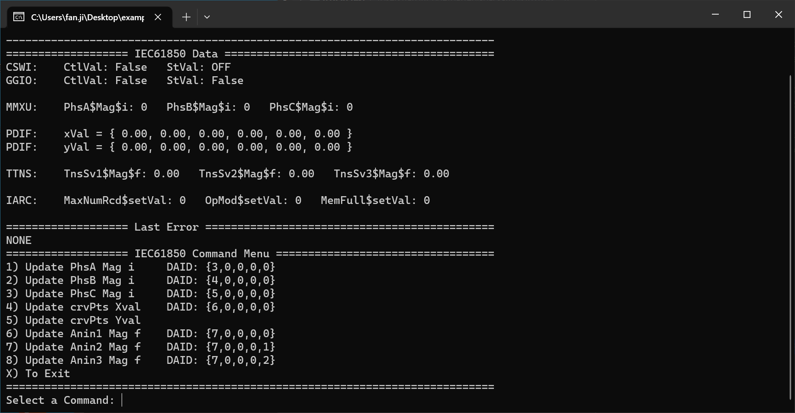
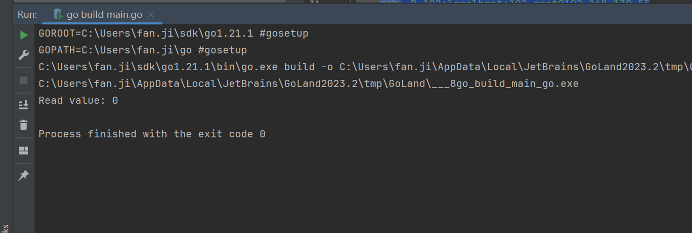
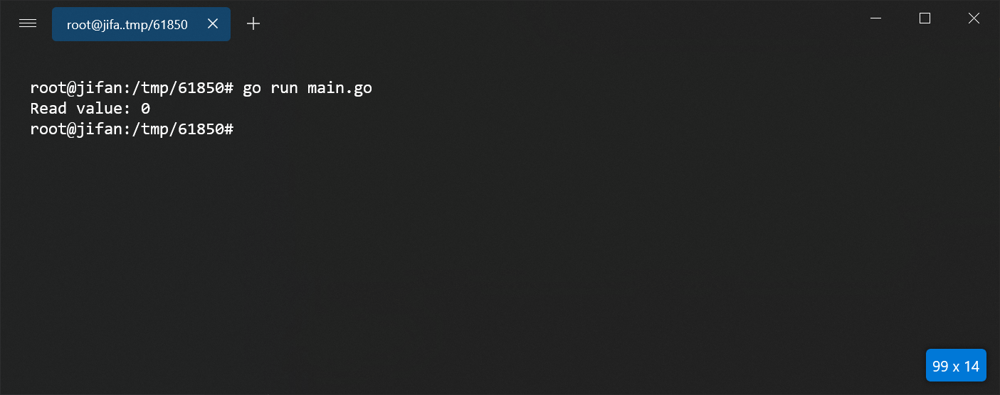

# 依赖版本

    https://github.com/mz-automation/libiec61850/commit/ab8ac8304d757aa925ec7c264c72171642babaca

# Linux AMD64

GCC版本：

    root@jifan:~# gcc -v
    Using built-in specs.
    COLLECT_GCC=gcc
    COLLECT_LTO_WRAPPER=/usr/lib/gcc/x86_64-linux-gnu/11/lto-wrapper
    OFFLOAD_TARGET_NAMES=nvptx-none:amdgcn-amdhsa
    OFFLOAD_TARGET_DEFAULT=1
    Target: x86_64-linux-gnu
    Configured with: ../src/configure -v --with-pkgversion='Ubuntu 11.4.0-1ubuntu1~22.04' --with-bugurl=file:///usr/share/doc/gcc-11/README.Bugs --enable-languages=c,ada,c++,go,brig,d,fortran,objc,obj-c++,m2 --prefix=/usr --with-gcc-major-version-only --program-suffix=-11 --program-prefix=x86_64-linux-gnu- --enable-shared --enable-linker-build-id --libexecdir=/usr/lib --without-included-gettext --enable-threads=posix --libdir=/usr/lib --enable-nls --enable-bootstrap --enable-clocale=gnu --enable-libstdcxx-debug --enable-libstdcxx-time=yes --with-default-libstdcxx-abi=new --enable-gnu-unique-object --disable-vtable-verify --enable-plugin --enable-default-pie --with-system-zlib --enable-libphobos-checking=release --with-target-system-zlib=auto --enable-objc-gc=auto --enable-multiarch --disable-werror --enable-cet --with-arch-32=i686 --with-abi=m64 --with-multilib-list=m32,m64,mx32 --enable-multilib --with-tune=generic --enable-offload-targets=nvptx-none=/build/gcc-11-XeT9lY/gcc-11-11.4.0/debian/tmp-nvptx/usr,amdgcn-amdhsa=/build/gcc-11-XeT9lY/gcc-11-11.4.0/debian/tmp-gcn/usr --without-cuda-driver --enable-checking=release --build=x86_64-linux-gnu --host=x86_64-linux-gnu --target=x86_64-linux-gnu --with-build-config=bootstrap-lto-lean --enable-link-serialization=2
    Thread model: posix
    Supported LTO compression algorithms: zlib zstd
    gcc version 11.4.0 (Ubuntu 11.4.0-1ubuntu1~22.04)

.lib依赖：./iec61850/lib/lin64/libiec61850.a

编译方法：

    在Linux中clone仓库https://github.com/mz-automation/libiec61850
    然后使用CMake编译，找到libiec61850.a

# Win64

MINGW安装及版本：

    MINGW安装：

    choco install mingw

    PS C:\Users\fan.ji> gcc -v
    Using built-in specs.
    COLLECT_GCC=C:\ProgramData\chocolatey\lib\mingw\tools\install\mingw64\bin\gcc.exe
    COLLECT_LTO_WRAPPER=C:/ProgramData/chocolatey/lib/mingw/tools/install/mingw64/bin/../libexec/gcc/x86_64-w64-mingw32/12.2.0/lto-wrapper.exe
    Target: x86_64-w64-mingw32
    Configured with: ../../../src/gcc-12.2.0/configure --host=x86_64-w64-mingw32 --build=x86_64-w64-mingw32 --target=x86_64-w64-mingw32 --prefix=/mingw64 --with-sysroot=/c/mingw-builds/ucrt64-seh-posix/x86_64-1220-posix-seh-ucrt-rt_v10-rev2/mingw64 --enable-host-shared --disable-multilib --enable-languages=c,c++,fortran,lto --enable-libstdcxx-time=yes --enable-threads=posix --enable-libgomp --enable-libatomic --enable-lto --enable-graphite --enable-checking=release --enable-fully-dynamic-string --enable-version-specific-runtime-libs --enable-libstdcxx-filesystem-ts=yes --disable-libstdcxx-pch --disable-libstdcxx-debug --enable-bootstrap --disable-rpath --disable-win32-registry --disable-nls --disable-werror --disable-symvers --with-gnu-as --with-gnu-ld --with-arch=nocona --with-tune=core2 --with-libiconv --with-system-zlib
    --with-gmp=/c/mingw-builds/ucrt64-seh-posix/prerequisites/x86_64-w64-mingw32-static --with-mpfr=/c/mingw-builds/ucrt64-seh-posix/prerequisites/x86_64-w64-mingw32-static --with-mpc=/c/mingw-builds/ucrt64-seh-posix/prerequisites/x86_64-w64-mingw32-static --with-isl=/c/mingw-builds/ucrt64-seh-posix/prerequisites/x86_64-w64-mingw32-static --with-pkgversion='x86_64-posix-seh-rev2, Built by MinGW-W64 project' --with-bugurl=https://sourceforge.net/projects/mingw-w64 CFLAGS='-O2 -pipe -fno-ident -I/c/mingw-builds/ucrt64-seh-posix/x86_64-1220-posix-seh-ucrt-rt_v10-rev2/mingw64/opt/include -I/c/mingw-builds/ucrt64-seh-posix/prerequisites/x86_64-zlib-static/include -I/c/mingw-builds/ucrt64-seh-posix/prerequisites/x86_64-w64-mingw32-static/include' CXXFLAGS='-O2 -pipe -fno-ident -I/c/mingw-builds/ucrt64-seh-posix/x86_64-1220-posix-seh-ucrt-rt_v10-rev2/mingw64/opt/include -I/c/mingw-builds/ucrt64-seh-posix/prerequisites/x86_64-zlib-static/include -I/c/mingw-builds/ucrt64-seh-posix/prerequisites/x86_64-w64-mingw32-static/include' CPPFLAGS=' -I/c/mingw-builds/ucrt64-seh-posix/x86_64-1220-posix-seh-ucrt-rt_v10-rev2/mingw64/opt/include -I/c/mingw-builds/ucrt64-seh-posix/prerequisites/x86_64-zlib-static/include -I/c/mingw-builds/ucrt64-seh-posix/prerequisites/x86_64-w64-mingw32-static/include' LDFLAGS='-pipe -fno-ident -L/c/mingw-builds/ucrt64-seh-posix/x86_64-1220-posix-seh-ucrt-rt_v10-rev2/mingw64/opt/lib -L/c/mingw-builds/ucrt64-seh-posix/prerequisites/x86_64-zlib-static/lib -L/c/mingw-builds/ucrt64-seh-posix/prerequisites/x86_64-w64-mingw32-static/lib ' LD_FOR_TARGET=/c/mingw-builds/ucrt64-seh-posix/x86_64-1220-posix-seh-ucrt-rt_v10-rev2/mingw64/bin/ld.exe --with-boot-ldflags=' -Wl,--disable-dynamicbase -static-libstdc++ -static-libgcc'
    Thread model: posix
    Supported LTO compression algorithms: zlib
    gcc version 12.2.0 (x86_64-posix-seh-rev2, Built by MinGW-W64 project)

GO:

    如果在windows下使用，配合以上MINGW版本，需要使用GOLANG1.21，测试通过
    GOLANG: 1.21.1

.lib依赖：./iec61850/lib/win64/libiec61850.a, ./iec61850/lib/win64/libhal.a 

编译方法：

    Windows中clone仓库https://github.com/mz-automation/libiec61850
    然后使用CMake编译，找到libiec61850.a, libhal.a

# 远程端口转发

将本地102端口转发到远程Linux便于Linux调试

首先需要确认远程计算机开启了转发

    ssh -R 102:localhost:102 root@your_linux_host

# 测试结果

WINDOWS服务端，也就是61850设备

WIN64客户端：

Linux64客户端：
